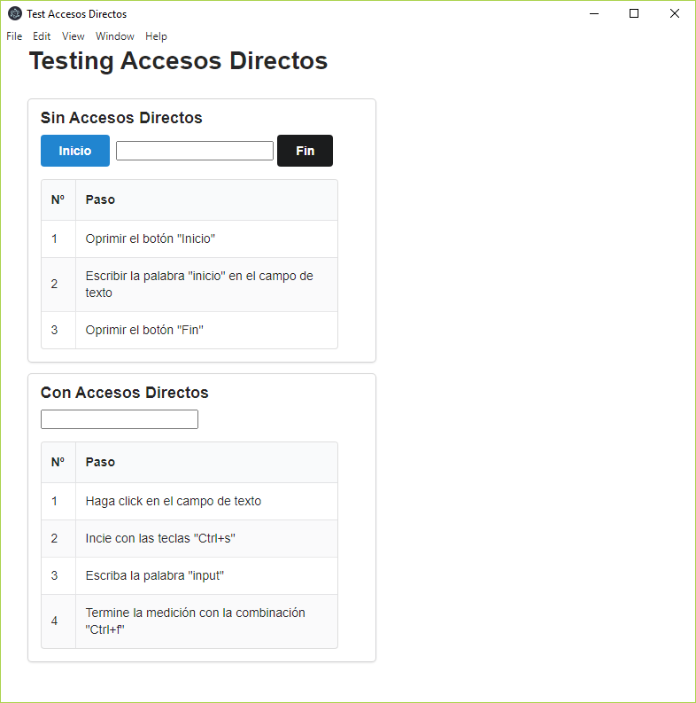

# Tester accesos directos.

App para demostrar la mejora en la productividad utilizando accesos directos para interactuar con las aplicaciones.

Por medio de 2 ejemplos, la app muestra la reducción de tiempo que implica el uso de accesos directos:




# Instrucciones

## Utilizando node:

Instalar librerías:

```js
npm install
npm start
```

## Auto ejecutable:

Para crear un ejecutable:

```js
npx electron-packager .
```